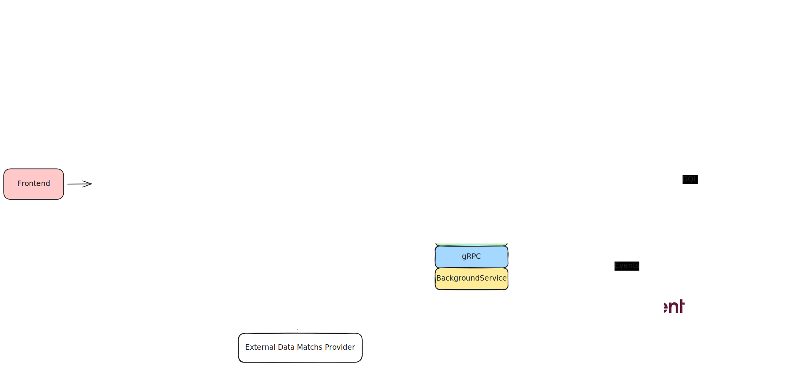

# FutNotes

## 🇺🇸 English Version

### 📝 Description

**FutNotes** is an application designed for sports commentators and journalists, allowing them to record real-time notes, match evaluations, and player performance ratings while watching football matches.  

The project was created primarily as a **practical study** of **CQRS** and **Event Sourcing**, using **.NET 8** as the main backend framework.

---

### 🎯 Project Goal

To build a **modular and scalable application**, evolving from a simple MVP into a complete **match analysis platform**.

---

### 🧠 Technologies Used

#### 🖥️ Backend (.NET 8 / C#)
- **ASP.NET Core Web API**  
- **Entity Framework Core**  
- **PostgreSQL**  
- **CQRS + Mediator Pattern (MediatR)**  
- **Kurrent.IO** – Event Sourcing database  
- **JWT Authentication**
- **gRPC** for internal communication between contexts/microservices
- **Grafana** for monitoring
- **Kubernetes** with **Istio Gateway API**

#### 📱 Frontend (Planned)
- **Flutter** or **Angular**

---

## Architecture of FootNotes

### Services

- IAM.API: Manage users and authentication
- Annotations.API: Manage match annotations
- MatchManagement.API: Manages the creation and updating of matches.
- MatchManagement.Integration: Integrates match context and annotations
- MatchManagement.Worker: Register matches using a match information provider.

## 🇧🇷 Versão em Português

### 📝 Descrição

O **FutNotes** é um aplicativo voltado para comentaristas e jornalistas esportivos, que permite registrar anotações, avaliações de partidas e desempenho de jogadores em tempo real enquanto assistem aos jogos.  

O projeto nasceu com o objetivo principal de **servir como estudo prático** de **CQRS e Event Sourcing** utilizando **.NET 8**.

---

### 🎯 Objetivo do Projeto

Criar uma aplicação modular e escalável, evoluindo de um MVP para um sistema completo de análise de partidas.

---

### Tecnologias Utilizadas

#### Backend (.NET 8 / C#)
- ASP.NET Core Web API  
- Entity Framework Core  
- PostgreSQL  
- CQRS + Mediator Pattern(Mediatr)  
- Kurrent.IO - Banco de dados para o Event Sourcing  
- JWT para autenticação  
- gRPC para comunicação interna entre contextos/microsserviços
- Grafana para monitoramento
- Kubernetes com Istio Gateway API

#### Frontend (planejado)
- Flutter ou Angular

---
